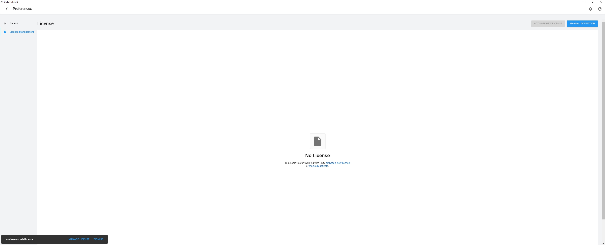

## Getting Started

* Open your web browser of choice and navigate to the [Unity Store](https://https://store.unity.com/download).
* Accept the Unity Personal **Terms of Service** by checking the box.
* Click on "Download Unity Hub" button to begin download.

## Installation First Steps

* Double-click the **UnityHubSetup.exe**.
* Choose your Destination Folder (or leave to default).
* Click **Finish** and leave **Run Unity Hub** box checked.

\*Note* If you have Windows Firewall enabled, a pop-up will appear during Unity Hub launch. Choose the network(s) you want Unity Hub to communicate with and clock on the Allow Access button to finish.

## Using Unity Hub

To begin using the Unity Hub, you must first login to your Unity account. 

* Click on the Unity ID icon on the top-right of the Unity Hub window.
* Click on **Sign In**
* Log in using your Unity profile credentials.
* Click on **Activate New License** button.
* Click on **Unity Personal**.
* Click on **I don't use Unity in a professional capacity**.
* Click **Done**.
  
Now that a license has been established, you should click the **Check for Updates** button to ensure that your license is up-to-date.

## Projects

Once you navigate back to Unity Hub's homepage, you have the option to create a new project or add one to your project list.

### Creating Projects

Before creating a new project, you must install an editor.

* Click on the **Installs** navigation button on the left side of the window.
* Click the **Add** button on the top-right of the window.
* Choose the version of Unity you would like added.
  * the latest version of Unity is chosen by default.
* Choose any additional modules that you would like installed.
* Agree to the terms and conditions. 
* Click **Done**.

Now that you have your editor installed, you can now begin to create new projects.

* Click **New** on the top-right side of the window.
* Select one of the predefined **Templates** 
* Name your project under **Project Name**.
* Choose where you want your projected locally stored under **Location**.
* Click **Create**.

## Using Unity with the Built-In Renderer

Unity's user interface (UI) has numerous tools to help you build your new project. 

### Creating a Game Asset 

Assets are different pieces of content that are part of a game. Some examples of game assets are audio files, models, maps, and text.

